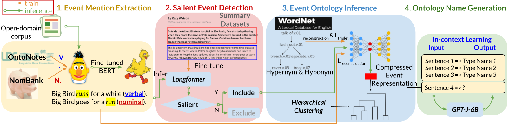

# CEO
This repository contains codes to apply **CEO** (method proposed in paper ``CEO: Corpus-based Open-Domain Event Ontology Induction``) for event ontology induction.

## Download
1. Codes
~~~~
git clone https://github.com/ceoeventontology/CEO
cd CEO
~~~~
2. Download trained models from [here](https://drive.google.com/file/d/1nHJgj9jhao8VjOEQu1NaUkTKyqWCryj-/view?usp=share_link)
```shell
unzip models.zip
```
3. Download sense embeddings from [here](https://drive.google.com/file/d/13SfS7leKvW7y9yZvDzE5y82xsc6RFy3i/view?usp=share_link) 
```shell
unzip senses.zip
mv senses ./resources/
```
4. (optionally) Download one sample dataset from Allsides of topic lgbt from [here](https://drive.google.com/file/d/1iHvoZz3jA3-EMpe7599m1jGxE9wcXqok/view?usp=share_link) and save it as `./datasets/allsides_lgbt.txt`), or create your own following guidance in [Dataset Preparation](#dataset-preparation).
## Environment Set-up
Packages required to run **CEO** are listed in `ENV.yaml`. Create a new conda environment from that file with following command:
```shell
conda env create -n <your environment name> --file ENV.yml
or
conda env create --prefix <path to your environment> --file ENV.yaml
conda activate <your environment name/path>
pip install allennlp==0.9.0

python -m spacy download en_core_web_sm
python -m spacy download en_core_web_lg
pip install torch==1.10.0+cu113 torchvision==0.11.0+cu113 torchaudio==0.10.0+cu113 -f https://download.pytorch.org/whl/torch_stable.html
```

## Dataset Preparation
For `type name generation`, we leverage in-context learning, where event examples from other labeled datasets are required as demonstrations.

In our paper, we select from `ACE2005` (private, <https://catalog.ldc.upenn.edu/LDC2006T06>), `MAVEN` (public, <https://github.com/THU-KEG/MAVEN-dataset>), `RAMS` (public, <https://nlp.jhu.edu/rams/>). 
We use training samples from one event dataset (`MAVEN` by default), so you can download **either** of them from the above links.

Please download the train files and put them in the following file structure

* CEO
    * resources
        * event_datasets
            * ace2005
                * $\text{\textcolor{blue}{train.oneie.json}}$
            * maven
                * $\text{\textcolor{blue}{train.jsonl}}$
            * rams
                * $\text{\textcolor{blue}{train.jsonlines}}$
## Input
Please process your corpus in the following format per line:
```python
{
    "doc_id": "276", 
    "sent_id": "276-0", 
    "tokens": ["NEW", "You", "can", "now", "listen", "to", "Fox", "News", "articles", "!"], 
    "sentence": "NEW You can now listen to Fox News articles!"
}
```
$\text{\textbf{\textcolor{red}{NOTE:}}}$ The document and sentence id are important to preserve document structure, 
please ensure the `doc_id` is a number (`"276""` is document id) and the sent_id is two numbers split by hyphen (e.g., `"276-0"` where `276` is document id and `0` is sentence id)

## Run CEO
You can simply run the following commnd to extract and name events for the open-domain corpus:
```shell
python open_corpus.py \
    --corpus_path ./datasets/allsides_lgbt.txt \
    --device_id 0 \
    --res_folder ./results/allsides_lgbt \
    --generator_model gpt-j-6b
```
Full list of parameters are explained as follows
1. `corpus_path`: the open copus path, './datasets/allsides_lgbt.txt' by default if you download the allsides lgbt dataset
1. `device_id`: the non-negative gpu device id
1. `res_folder`: the path you want to save outputs
1. `overwrite`: whether you want to overwrite all previous outputs in the `res_folder`
1. `seed`: random seed
1. `top_percentile`: top percentile of extracted events of a single document is considered **salient**
1. `ref_events`: auto-encoder models trained to learn event embeddings from the external knowledge `WordNet` together with this event dataset, select from `ace2005, rams, maven`
1. `generator_model`: the generative model for event type name generation, select from `gpt2` models of different scales as well as `gpt-j-6b`
1. `demo_dataset`: the event source to sample as demonstrations for in-context learning, select from `ace2005, rams, maven`

**CEO** conducts the following steps sequentially to induce event ontology.


#### Step I: Event Extraction
Extract events and relevant information with BERT-based models trained on NomBank and OntoNotes (output saved in `$res_folder/event_extraction`).

#### Step II: Salient Event Detection
We utilize salience detection model trained on summary dataset (newyork time corpus) to identify corpus-wise salient events (output saved `$res_folder/salient_event_detection`).

#### Step III: Get Plain Event Embeddings
We obtain salient event embeddings by averaging over their multiple aspects of information, such as sentence representation,
predicate representation, subject and object representation, sense definition and example representation (output saved in `$res_folder/plain_embedding`).

#### Step IV: Get Improved Embeddings
We exploit external event knowledge from WordNet by training an autoencoder with triplet loss. Given plain event embeddings as input, we use representations
in the latent compressed space of autoencoder as the improved embedding (output saved in `$res_folder/improved_embedding`).

#### Step V: Hierarchical Clustering
With improved event representations, we use [linkage ward](https://docs.scipy.org/doc/scipy/reference/generated/scipy.cluster.hierarchy.linkage.html) algorithm to
cluster them in a tree-structure ontology (output saved in `$res_folder/hierarchical_clustering`).

#### Step VI: Type Name Generation
For one leaf node (sample) in the tree ontology, the finest type name is inferred by in-context learning with generative language models.
For one internal node (cluster) in the tree onotlogy, the coarse type name for all included samples is the token with maximum average probability from leaves (output saved in `$res_folder/name`).

## Output
The expected output in `$res_folder/name/event_type_names.json` is a text file, one event dict per line as follows:
```python
{
    "doc_id": "276", 
    "sent_id": "276-17", 
    "predictions": [
        {
            "predicate_lemma": ["establish"], 
            "predicate_index": [27], 
            "predicate_text": "established", 
            "type_names": "be:make:policy"
        }
    ], 
    "tokens": ["Becerra", "said", "the", "new", "Biden", "administration", "policy", "would", "bring", "HHS", "into", "line", "with", "a", "landmark", "Supreme", "Court", "decision", "last", "year", "in", "a", "workplace", "discrimination", "case", ",", "which", "established", "that", "federal", "laws", "against", "sex", "discrimination", "on", "the", "job", "also", "protect", "gay", "and", "transgender", "people", "."], 
    "sentence": "Becerra said the new Biden administration policy would bring HHS into line with a landmark Supreme Court decision last year in a workplace discrimination case, which established that federal laws against sex discrimination on the job also protect gay and transgender people."
}
```
$\text{\textbf{\textcolor{red}{NOTE:}}}$ each element in `"predictions"` is one identified salient events. For sentences without inferred salient events,
`"predictions"` is an empty list.

## Acknowledgement
We thank authors from <https://github.com/CogComp/SRL-English> to provide basic
codes for semantic role labeling. We adopt and modify in `/CEO/SRL` to train BERT-based models
for extracting event information such as  verbal and nominal predicate, their semantic senses, arguments, etc.
